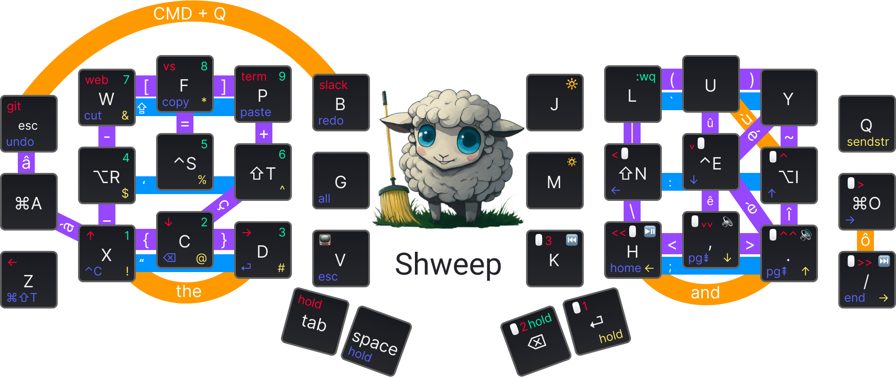

# 🧹🐑 Shweep – 34 keys QMK Layout

_...for the Aurora Sweep using both Layers & Combos!_

## Keymap

_Figma layout made thanks to [@madhanparthasar](https://www.figma.com/@madhanparthasar)'s [Ortholinear Keyboard Keybinding Layout Tool
](https://www.figma.com/community/file/1283154322826272613)_ 🙌



## Origins

This layout is organic and keeps evolving based on the following:

- real needs: reduce hand gestures, reduce frequently used keystrokes, etc.
- exploration need: custom keebs offer a brand new experience, and I love to explore what is possible out there

It's not a surprise that this keymap is a hybrid. Two opposite approaches inspired it:

- [Miryoku](https://github.com/manna-harbour/miryoku) – a full-layer COLMAK-DH keymap that has excellent [principles](https://github.com/manna-harbour/miryoku/tree/master/docs/reference#general-principles):
  - Use layers instead of reaching.
  - Use both hands instead of contortions.
  - Use the home positions as much as possible.
  - Make full use of the thumbs.
  - Avoid unnecessary complications.
- [Kombol](https://github.com/skychil/kombol) – a combo-optimized keymapping. This extends Miryoku and removes some confusion for keys like `[]`, `{}`, `()`, `-=+`, `' "`, `; :`, ... that I had some hard time mastering with Miryoku.

The QMK code is inspired by the [sweep_keymap from flinguenheld](https://github.com/flinguenheld/sweep_keymap).

### Trackball / Trackpad mode

Using a trackball/trackpad feels excellent for many gestures. But when it's time to click, you'll find your pointer movement affected by the click action!

- With a trackpad, you must either bring your hand off the pad and click or you must add pressure to the pad, thus moving the cursor (you click and lose precision!).
- With  a trackball: pressing the click while your hand is on the ball will make your cursor move slightly, reducing the precision of the click.

A good way to resolve these issues is to click with the left hand—i.e., control your cursor with two hands!


_That's a [Ploopy Adept](https://ploopy.co/adept-trackball/) in case you are wondering!_

While holding `Z` with your pinky, you activate the momentary mouse layer:

- Tap `D` for a left-click
- Hold `D` and move the cursor with the other hand for Drag&Drop
- Tap `C` for a right-click
- Tap `X` for the "Smart zoom" (or any command mapped to your mouse `BTN_4`)
- Hold `X` to enable the Scroll mode (moving the cursor will act as scrolling)

Smart Zoom and Scroll mode are possible with [Mac Mouse Fix](https://macmousefix.com/) on Mac OS.
On Windows, I use [X-Mouse Button Control](https://www.highrez.co.uk/downloads/XMouseButtonControl.htm), but it only works for Scroll mode (let me know if you find a way to get a Smart Zoom 🙏🏼)

The key `A` has the home-row modifier for `CMD` (default layer) or `CTL` (Windows layer).
This is super handy as you can use your pinky to enable the mouse layer WITH these modifiers.
I often use that to open links in new tabs (CMD + left-click).

### Tap Dance

#### Apps shortcuts doubled with long-tap

You'll find some tap-dance actions on the `_MOUSE` layer. For example: `TD(TD_BROWSER)`.
This allows the keyboard to respond to 2 different events: normal tap and long tap (down until the tapping term, then up).

I use that for:

- Browser: short tap is working/codding (Chrome) / long tap is personal browser (Brave).
- GitHub App / Figma App: as Figma is less used, it is mapped to the long tap.
- Rectangle (windows management for Mac): a normal tap moves the windows on another screen, and a long tap makes the window full-screen.

See `features/tap_dance.c` for the implementation.

### Refinements

- `#define QUICK_TAP_TERM 0` disable the `QUICK_TAP_TERM`.
  This allows double-tapping a modifier key (and holding it on the second tap) to trigger the hold action.
  In the context of this keyboard, a simple example is
  "you tipped a wrong number; correct it with `tap BCKSP` then `hold BCKSP` (NUM LAYER), then your number.
  The double `BACKSP` requires activating the layer, not switching to `QUICK_TAP_TERM` and repeating your backspace.
- This layout CANNOT use `#define HOLD_ON_OTHER_KEY_PRESS` due to the home-row modifier:
  This feature allows modifiers to trigger faster but prevents the home-row keys from rolling.

### Arbitrations

The backspace key cannot be pressed long to remove a chain of characters until it's released.
I'm pleased about this "limitation" because it forced me to learn better ways to remove text:

- use `CMD + backspace` to delete characters until the start of the line
- use `OPT + backspace` to delete characters until the start of the word
- use `SHIFT + arrows` to select the part of the text to remove (arrows allow for being triggered many times when kept pressed). This allows me to ensure the expected characters are selected before I press the backspace key – it's easier to fix a bad text selection than to `undo` a chain backspace with precision (generally, the whole chain removal will be undone when you expect only to undo 1 or 2 characters)

## Install

Add this repos as a git submodule inside the `qmk_firmware/keyboards/splitkb/aurora/sweep/keymaps/` folder:

```shell
cd qmk_firmware/keyboards/splitkb/aurora/sweep/keymaps
git submodule add https://github.com/malparty/shweep.git
cd ../../../../../
make git-submodule
cd keyboards/splitkb/aurora/sweep/keymaps/shweep
```

## Compile and flash

Navigate into the keymap folder `keyboards/splitkb/aurora/sweep/keymaps/shweep`.

Compile with `qmk compile` and flash both sides with `qmk flash`.
