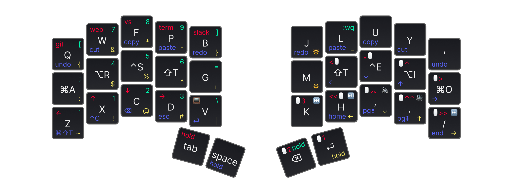
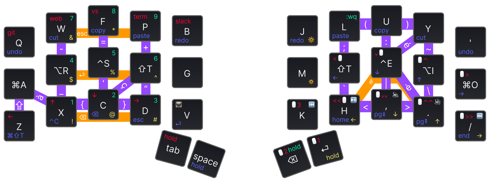

# xavv1 – 34 keys hybrid Layout & Combo

## Keymaps

The below Figma layout were made thanks to [@madhanparthasar](https://www.figma.com/@madhanparthasar)'s [Ortholinear Keyboard Keybinding Layout Tool
](https://www.figma.com/community/file/1283154322826272613) 🙌

### Layers only

### Hybrid Combos & Layers

## Origins

This layout is organic and keeps evolving based on:

- real needs: reduce hand gestures, reduce frequently used keystrokes, etc.
- exploration need: custom keebs offer a brand new experience and I love to explore what is possible out there

It's not a surprise that this keymap is a hybrid. It was inspired by 2 opposite approaches:

- [Miryoku](https://github.com/manna-harbour/miryoku) – a full layer COLMAK-DH keymap, that has excellent [principles](https://github.com/manna-harbour/miryoku/tree/master/docs/reference#general-principles):
  - Use layers instead of reaching.
  - Use both hands instead of contortions.
  - Use the home positions as much as possible.
  - Make full use of the thumbs.
  - Avoid unnecessary complication.
- [Kombol](https://github.com/skychil/kombol) – a combo optimized keymapping. This extends Miryoku and removes some confusion for keys like `[]`, `{}`, `()`, `-=+`, `' "`, `; :`, ... that I had some hard time mastering with Miryoku.

The QMK code is based on the [sweep_keymap from flinguenheld](https://github.com/flinguenheld/sweep_keymap).

My code is probably NOT clean, I would NOT recommend using it as a starting point to create a brand new keymap.
But you can explore some features and take the pieces you want.

### Tap Dance

TODO: Add documentation on what it does to get the layer switch to work as I needed it to work.

## Install

Clone this repo in the folder :

    ~/qmk_firmware/keyboards/splitkb/aurora/sweep/keymaps/

## Compile and flash

Navigate into the keymap folder `keyboards/splitkb/aurora/sweep/keymaps/xavv1`.

Compile with `qmk compile` and flash both sides with `qmk flash`.
